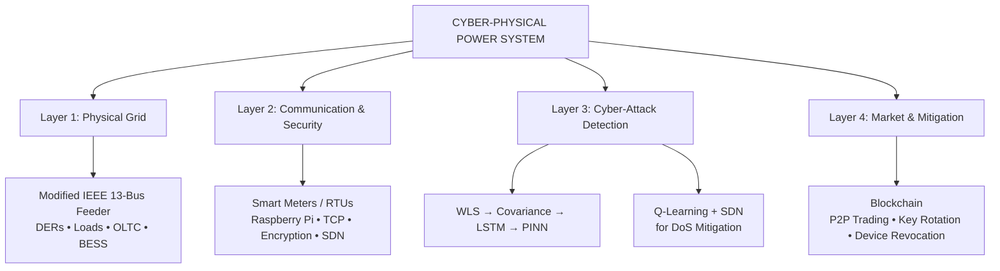
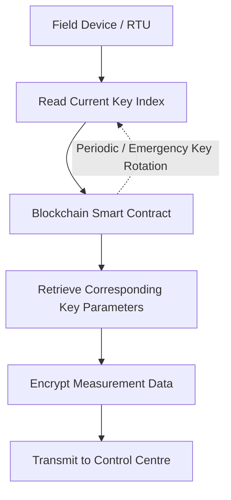
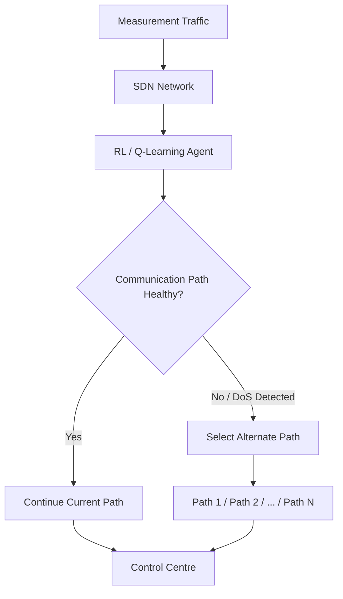
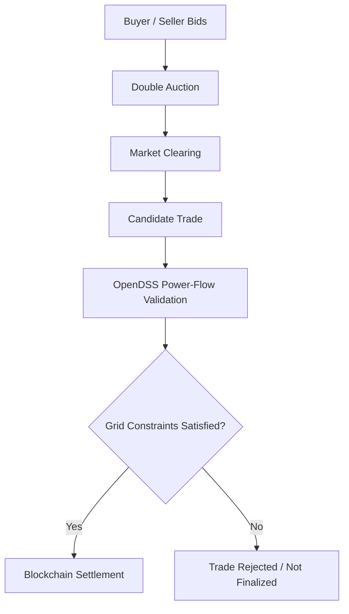
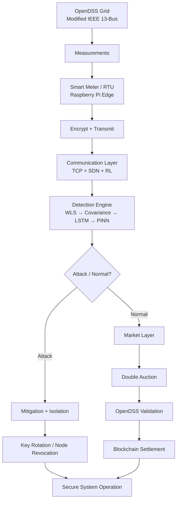

live demo:   https://smart-grid-cyber-res-c7ox.bolt.host/
# Cyber-Physical Power System Resilience Using Blockchain and ML

A cyber-physical power system (CPPS) framework that combines **power-system simulation, blockchain-based peer-to-peer energy trading, machine learning, physics-informed detection, and communication-network resilience** to improve the security and operational reliability of decentralized distribution networks.

## Overview

The increasing integration of distributed energy resources (DERs), smart meters, IoT devices, and peer-to-peer (P2P) energy trading introduces new cyber-physical security challenges. A trading platform may make economically valid decisions while unintentionally creating unsafe electrical conditions, and compromised measurements can influence both grid operation and market decisions.

This project addresses that problem by integrating the **physical power grid, secure communication, cyber-attack detection, decentralized energy trading, and autonomous mitigation** into a single cyber-physical framework.

The system is evaluated using a modified **IEEE 13-bus distribution feeder in OpenDSS**, an Ethereum-based local blockchain network, Python-based control and detection services, Raspberry Pi-based communication hardware, and a web-based energy trading interface.

---

## Key Objectives

- Model a realistic distribution network containing consumers and distributed energy resources.
- Connect simulated/edge measurements to a central monitoring and control layer.
- Provide blockchain-based P2P energy trading using a double-auction market.
- Verify candidate energy trades against electrical-grid constraints before settlement.
- Protect measurement communication using blockchain-coordinated key management.
- Detect multiple classes of cyber-attacks using a layered detection architecture.
- Mitigate communication-layer Denial-of-Service (DoS) attacks using SDN and Q-learning.
- Automatically isolate compromised devices through blockchain-based revocation.
- Maintain coordination between cybersecurity events, grid operation, and the energy market.

---

## System Architecture

The framework is organized into four major layers:

> **GitHub rendering:** The flowcharts use Mermaid, so GitHub can render them as proper diagrams without the alignment problems of ASCII boxes.

### 1. Physical Grid Layer

The physical network is based on a modified IEEE 13-bus radial distribution feeder modeled in **OpenDSS**.

The model incorporates:

- Distributed Energy Resources (DERs)
- Solar PV prosumers
- Wind generation
- Battery Energy Storage Systems (BESS)
- Residential and consumer loads
- Capacitor-bank reactive power support
- On-Load Tap Changer (OLTC)
- Controllable breaker for cyber-physical studies
- Grid-forming generation for islanding studies

The simulation operates at a **5-second measurement cycle** and provides bus voltage magnitudes, active-power injections, and reactive-power injections for monitoring and detection.

The modeled test configuration contains **15 grid nodes: 3 DER prosumers and 12 consumer loads**.

---

## 2. Communication and Security Layer

The communication layer connects field devices with the monitoring and control centre.

### Edge Devices

The testbed uses:

- Smart-meter/RTU measurement sources
- Raspberry Pi-based edge communication
- TCP-based data transmission
- Measurement noise modeling
- Encrypted measurement streams

The edge devices obtain the currently active cryptographic key information through the blockchain coordination mechanism before encrypting measurements.

### Blockchain-Based Key Management

The blockchain is used as a coordination mechanism for key-index management rather than directly transmitting encryption keys.

The process is:

Key indices can be rotated periodically, with emergency rotation also supported. Blockchain records provide an auditable history of key-management events.

This creates a moving-target style security mechanism in which devices synchronously change the active encryption parameters.

---

## 3. Cyber-Attack Detection Layer

The detection system uses a layered approach because no single detector is expected to identify every attack type.

### Layer 1 — Weighted Least Squares (WLS)

WLS state estimation is used to estimate the grid state and identify conventional measurement anomalies through residual-based bad-data detection.

It is particularly useful for detecting **blatant False Data Injection (FDI)** attacks.

### Layer 2 — Covariance-Based Anomaly Detection

The covariance detector analyzes relationships among measurements over time.

It is intended to identify:

- Coordinated multi-bus anomalies
- Correlated measurement changes
- False Command Injection (FCI)-related disturbances

This layer complements WLS by examining correlation structures that may not be obvious from individual residuals.

### Layer 3 — LSTM-Based Temporal Detection

A multi-layer Long Short-Term Memory (LSTM) model processes temporal measurement sequences.

The purpose is to detect **stealthy FDI attacks** that can remain statistically consistent enough to bypass conventional residual-based detection.

### Layer 4 — Physics-Informed Neural Network (PINN)

The PINN adds power-system physical constraints to the learning process.

The model is designed to:

- Classify anomalous behavior
- Evaluate physics consistency
- Calculate physics-related residuals
- Localize affected buses

This allows the detection process to consider both measurement patterns and electrical-system behavior.

---

## 4. DoS Mitigation Using RL-SDN

Denial-of-Service attacks target the availability of measurement data rather than simply changing its numerical value.

The project uses:

- Software-Defined Networking (SDN)
- Q-learning
- Multiple redundant communication paths
- Network-latency monitoring

The RL agent observes communication conditions and selects an appropriate routing action.

When a sustained data interruption is detected, the agent can instruct the SDN layer to reroute measurement traffic through another available path.

---

# 5. Blockchain-Based P2P Energy Trading

The market layer is implemented on a local Ethereum-compatible test network using **Hardhat** and a Solidity smart contract.

The system supports decentralized P2P energy trading between prosumers and consumers.

## Double-Auction Market

Participants submit:

- Buy bids from consumers
- Sell asks from prosumers

The smart contract determines the market-clearing point based on the supply and demand curves.

An important feature of the architecture is that an economically valid trade is **not immediately treated as physically valid**.

The workflow is:

Candidate trades are checked against grid operating constraints, including the modeled voltage range of approximately **0.95–1.05 pu**.

This creates a cyber-physical connection between the energy market and the electrical network.

---

# 6. Smart Contract Functions

The blockchain layer combines several security and market functions:

### P2P Energy Trading

- Bid/ask submission
- Double-auction clearing
- Market settlement
- On-chain event logging

### Key Management

- Key-index storage
- Key-index updates
- Periodic key rotation
- Emergency key rotation

### Device Authentication

- Role-based device registration
- Blockchain-address-based identity
- Device status management

### Device Revocation

When a device is confirmed as compromised, its blockchain status can be disabled.

The revoked device is prevented from participating in:

- Future energy trading
- Measurement-stream participation
- Protected system communication

---

# 7. Cyber-Attack Scenarios

The framework evaluates multiple attack classes.

## False Data Injection (FDI)

Two major FDI scenarios are considered:

### Blatant FDI

Large measurement deviations are injected into measurement streams.

In the reported simulation, an attacked voltage measurement rises to approximately **1.25 pu** compared with an actual value around **1.05 pu**. The WLS residual crosses the bad-data threshold during the attack.

### Stealthy-Coordinated FDI

The attack is designed to remain consistent with the mathematical structure of the power-system model.

The reported results show that the WLS residual can remain below the conventional threshold during this attack, while the LSTM/PINN-based detection stage identifies the abnormal behavior.

---

## False Command Injection (FCI)

The project models malicious manipulation of physical control commands, including:

- OLTC tap manipulation
- Capacitor-bank switching
- Breaker/line switching

These attacks can alter physical grid conditions even when measurement data itself appears normal.

The layered detector combines covariance analysis, temporal learning, and physics-based validation to identify the resulting abnormal behavior.

---

## Denial-of-Service (DoS)

The communication channel is disrupted so that measurement data is delayed or unavailable.

The RL-SDN mechanism detects sustained data interruption and reroutes traffic through an alternative communication path.

---

# 8. Monitoring and Control Centre

The central monitoring and control layer acts as the bridge between the physical grid, communication network, detection algorithms, and blockchain market.

The control architecture includes Python-based services responsible for:

- Measurement processing
- Data decryption
- State estimation
- Anomaly detection
- Trade verification
- OpenDSS power-flow validation
- Device authentication
- Attack response
- Blockchain interaction
- Communication monitoring

The system also provides dashboards for:

- Energy trading
- Blockchain device registry
- Cyber-attack injection
- Stealthy attack monitoring
- FCI monitoring
- DoS mitigation

---

# 9. Technology Stack

| Category | Technologies |
|---|---|
| Power-system simulation | OpenDSS |
| Power-system model | Modified IEEE 13-bus feeder |
| Programming | Python |
| Blockchain | Ethereum-compatible local network |
| Blockchain development | Hardhat |
| Smart contracts | Solidity |
| Web3 integration | Web3 / blockchain RPC |
| Frontend | HTML, CSS, JavaScript |
| Backend/control | Python Flask |
| Machine Learning | LSTM |
| Physics-based AI | PINN |
| Reinforcement Learning | Q-learning |
| Network resilience | SDN |
| Edge hardware | Raspberry Pi |
| Communication | TCP |
| Energy market | P2P double auction |

---

# 10. Simulation Configuration

| Parameter | Configuration |
|---|---|
| Test system | Modified IEEE 13-bus feeder |
| Simulation platform | OpenDSS |
| Grid nodes | 15 |
| DER prosumers | 3 |
| Consumer loads | 12 |
| Measurement interval | 5 seconds |
| Blockchain | Ethereum local test network |
| Blockchain framework | Hardhat |
| Smart contract | Solidity ^0.8.28 |
| Detection models | WLS, covariance, LSTM, PINN |
| DoS mitigation | Q-learning + SDN |
| Attack scenarios | Blatant FDI, stealthy FDI, FCI, DoS |

---

# 11. Reported Results

The project validates the integrated framework under normal operation and multiple cyber-attack scenarios.

### Blatant FDI

- The injected measurement produces a significant deviation from the actual voltage.
- The WLS residual exceeds the bad-data detection threshold.
- The attack is detected during the attack interval.

### Stealthy FDI

- The WLS residual remains below the conventional threshold during the modeled stealthy attack.
- The LSTM/PINN detection stage identifies the abnormal temporal and physical behavior.
- The PINN stage also provides physics-residual information for affected-bus analysis.

### FCI

- Conventional WLS may not identify all command-related anomalies directly.
- Covariance analysis, LSTM, and PINN provide additional detection capability.
- The monitoring dashboard identifies suspicious nodes and displays the associated measurements.

### DoS

- Communication latency/data interruption is monitored.
- The Q-learning SDN agent detects the communication disruption.
- Traffic is rerouted through an alternate path to restore measurement flow.

### P2P Market

The reported double-auction simulation clears **4 kWh** of energy at approximately **0.023 ETH per unit of electricity** for the modeled 15-node network.

---

# 12. Key Contributions

The project brings together several technologies into a single cyber-physical framework:

1. **Grid-aware P2P energy trading**  
   Energy trades are connected to physical power-flow validation rather than being treated only as financial transactions.

2. **Layered cyber-attack detection**  
   WLS, covariance analysis, LSTM, and PINN are combined to address different classes of anomalies.

3. **Physics-aware machine learning**  
   PINN-based detection incorporates electrical-system behavior into the anomaly-detection process.

4. **Blockchain-assisted security**  
   Blockchain provides decentralized records for market transactions, device status, and key-index management.

5. **Autonomous device revocation**  
   Confirmed compromised nodes can be removed from future market and measurement participation.

6. **Communication resilience**  
   Q-learning and SDN provide dynamic rerouting during communication disruptions.

7. **Integrated cyber-physical validation**  
   The framework connects the energy market, physical grid, cybersecurity layer, and control centre in one workflow.

---

# 13. Overall Workflow

# 14. Future Scope

Potential extensions include:

- Real-time hardware implementation with physical smart meters and edge controllers.
- Integration with larger distribution networks.
- Graph Neural Networks (GNNs) for scalable cyber-attack detection.
- Federated learning for distributed model training.
- Adaptive reinforcement learning for dynamic network conditions.
- Autonomous fault isolation and self-healing operation.
- Predictive AI-based grid control.
- EV charging and vehicle-to-grid integration.
- Coordinated energy management for smart-city applications.
- Cyber-resilient autonomous microgrids.
- Hardware-in-the-loop validation with real-time digital simulators.

## Keywords

`Cyber-Physical Power Systems` `CPPS` `Smart Grid` `Power Systems` `P2P Energy Trading` `Blockchain` `Ethereum` `Hardhat` `Smart Contracts` `OpenDSS` `IEEE 13-Bus` `Machine Learning` `LSTM` `PINN` `False Data Injection` `False Command Injection` `DoS` `Q-Learning` `SDN` `DER` `BESS` `Smart Meter` `Raspberry Pi` `Cybersecurity` `Grid Resilience`
